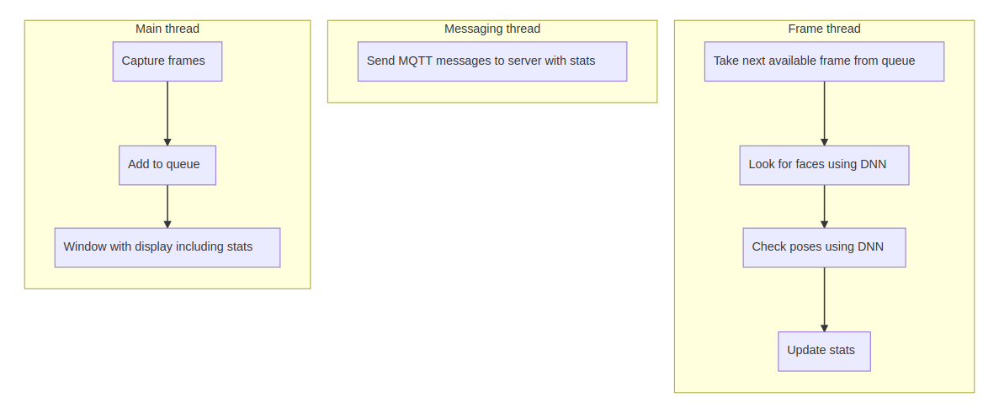

# Shopper Gaze Monitor

| Details            |              |
|-----------------------|---------------|
| Target OS:            |  Ubuntu\* 16.04 LTS   |
| Programming Language: |  C++\* |
| Time to Complete:    |  45 min     |


## Introduction

This shopper gaze monitor application is one of a series of reference implementations for Computer Vision (CV) using the OpenVINO™ toolkit. This application is designed for a retail shelf mounted camera system that counts the the number of passers-by that look toward the display vs. the number of people that pass by the display without looking. It is intended to provide real-world marketing statistics for in-store shelf-space advertising.

## Requirements

### Hardware
* 6th Generation Intel® Core™ processor with Intel® Iris® Pro graphics and Intel® HD Graphics

### Software
* [Ubuntu\* 16.04 LTS](http://releases.ubuntu.com/16.04/)
*Note*: You must be running kernel version 4.7+ to use this software. We recommend using a 4.14+ kernel to use this software. Run the following command to determine your kernel version:
```
uname -a
```
* OpenCL™ Runtime Package
* OpenVINO™ toolkit

## Setup

### Install OpenVINO™ Toolkit
Refer to https://software.intel.com/en-us/articles/OpenVINO-Install-Linux for more information about how to install and setup the OpenVINO™ toolkit.

You will need the OpenCL™ Runtime package if you plan to run inference on the GPU as shown by the
instructions below. It is not mandatory for CPU inference.

## How it works

The application uses a video source, such as a camera, to grab frames, and then uses 2 different Deep Neural Networks (DNNs) to process the data. The first network looks for faces, and then if successful is counted as a "shopper"

A second neural network is then used to determine the head pose detection for each detected face. If the person's head is facing towards the camera, it is counted as a "looker".

The data can then optionally be sent to a MQTT machine to machine messaging server, as part of a retail data analytics system.

The DNN models used are Intel® optimized models that are part of the OpenVINO™ toolkit.

You can find them here:

- /opt/intel/computer_vision_sdk/deployment_tools/intel_models/face-detection-adas-0001
- /opt/intel/computer_vision_sdk/deployment_tools/intel_models/head-pose-estimation-adas-0001



The program creates three threads for concurrency:

- main thread that performs the video i/o
- worker thread that processes video frames using the deep neural networks
- worker thread that publishes any MQTT messages

## Setting the build environment

You must configure the environment to use the OpenVINO™ toolkit one time per session by running the following command:

    source /opt/intel/computer_vision_sdk/bin/setupvars.sh

## Building the code

Start by changing the current directory to wherever you have git cloned the application code. For example:

    cd shopper-gaze-monitor-cpp

If you do not yet have a `build` directory create one:

    mkdir build

Then change to that directory:

    cd build

Now run the following commands:

    cmake ..
    make

Once the commands are finished, you should have built the `monitor` application executable.

## Running the code

To see a list of the various options:

    ./monitor -h

To run the application with the needed models using the webcam:

    ./monitor -m=/opt/intel/computer_vision_sdk/deployment_tools/intel_models/face-detection-adas-0001/FP32/face-detection-adas-0001.bin -c=/opt/intel/computer_vision_sdk/deployment_tools/intel_models/face-detection-adas-0001/FP32/face-detection-adas-0001.xml -pm=/opt/intel/computer_vision_sdk/deployment_tools/intel_models/head-pose-estimation-adas-0001/FP32/head-pose-estimation-adas-0001.bin -pc=/opt/intel/computer_vision_sdk/deployment_tools/intel_models/head-pose-estimation-adas-0001/FP32/head-pose-estimation-adas-0001.xml

### Hardware acceleration

This application can take advantage of the hardware acceleration in the OpenVINO toolkit by using the `-b` and `-t` parameters.

For example, to use the OpenVINO™ toolkit backend with the GPU in 32-bit mode:

    ./monitor -m=/opt/intel/computer_vision_sdk/deployment_tools/intel_models/face-detection-adas-0001/FP32/face-detection-adas-0001.bin -c=/opt/intel/computer_vision_sdk/deployment_tools/intel_models/face-detection-adas-0001/FP32/face-detection-adas-0001.xml -pm=/opt/intel/computer_vision_sdk/deployment_tools/intel_models/head-pose-estimation-adas-0001/FP32/head-pose-estimation-adas-0001.bin -pc=/opt/intel/computer_vision_sdk/deployment_tools/intel_models/head-pose-estimation-adas-0001/FP32/head-pose-estimation-adas-0001.xml -b=2 -t=1

To run the code using 16-bit floats, you have to both set the `-t` flag to use the GPU in 16-bit mode, as well as use the FP16 version of the Intel® models:

    ./monitor -m=/opt/intel/computer_vision_sdk/deployment_tools/intel_models/face-detection-adas-0001/FP16/face-detection-adas-0001.bin -c=/opt/intel/computer_vision_sdk/deployment_tools/intel_models/face-detection-adas-0001/FP16/face-detection-adas-0001.xml -pm=/opt/intel/computer_vision_sdk/deployment_tools/intel_models/head-pose-estimation-adas-0001/FP16/head-pose-estimation-adas-0001.bin -pc=/opt/intel/computer_vision_sdk/deployment_tools/intel_models/head-pose-estimation-adas-0001/FP16/head-pose-estimation-adas-0001.xml -b=2 -t=2

## Sample videos

There are several videos available to use as sample videos to show the capabilities of this application. You can download them by running these commands from the `shopper-gaze-monitor` directory:

    mkdir resources
    cd resources
    wget https://github.com/intel-iot-devkit/sample-videos/raw/master/face-demographics-walking-and-pause.mp4
    wget https://github.com/intel-iot-devkit/sample-videos/raw/master/face-demographics-walking.mp4
    cd ..
    
To then execute the code using one of these sample videos, run the following commands from the `shopper-gaze-monitor` directory:

    cd build
    ./monitor -m=/opt/intel/computer_vision_sdk/deployment_tools/intel_models/face-detection-adas-0001/FP32/face-detection-adas-0001.bin -c=/opt/intel/computer_vision_sdk/deployment_tools/intel_models/face-detection-adas-0001/FP32/face-detection-adas-0001.xml -pm=/opt/intel/computer_vision_sdk/deployment_tools/intel_models/head-pose-estimation-adas-0001/FP32/head-pose-estimation-adas-0001.bin -pc=/opt/intel/computer_vision_sdk/deployment_tools/intel_models/head-pose-estimation-adas-0001/FP32/head-pose-estimation-adas-0001.xml -i=../resources/face-demographics-walking-and-pause.mp4

### Machine to machine messaging with MQTT

If you wish to use a MQTT server to publish data, you should set the following environment variables before running the program:

    export MQTT_SERVER=localhost:1883
    export MQTT_CLIENT_ID=cvservice

Change the `MQTT_SERVER` to a value that matches the MQTT server you are connecting to.

You should change the `MQTT_CLIENT_ID` to a unique value for each monitoring station, so you can track the data for individual locations. For example:

    export MQTT_CLIENT_ID=shelf1337
