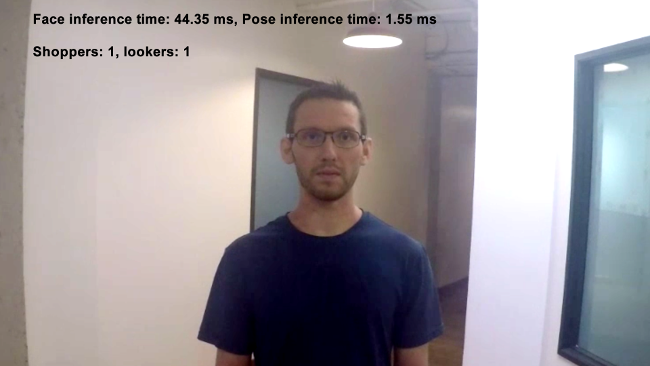

# Shopper Gaze Monitor

| Details            |              |
|-----------------------|---------------|
| Target OS:            |  Ubuntu\* 18.04 LTS   |
| Programming Language: |  C++ |
| Time to Complete:    |  45 min     |



## What it does

This application is designed for a retail shelf mounted camera system that counts the number of passers-by and the number of people who look towards the display. It is intended to provide real-world marketing statistics for in-store shelf-space advertising.

## Requirements

### Hardware
* 6th to 8th Generation Intel® Core™ processors with Intel® Iris® Pro graphics or Intel® HD Graphics

### Software
* [Ubuntu\* 18.04 LTS](http://releases.ubuntu.com/18.04/)<br><br>
*Note*: We recommend using a 4.14+ kernel to use this software. Run the following command to determine your kernel version:
    ```
    uname -a
    ```
* OpenCL™ Runtime Package
* Intel® Distribution of OpenVINO™ toolkit 2020 R3 release

## How it works

The application uses a video source, such as a camera, to grab frames and then uses two different Deep Neural Networks (DNNs) to process the data. The first network looks for faces, if successful counted as a "Shopper".

A second neural network is then used to determine the head pose detection for each detected face. If the person's head is facing towards the camera, it is counted as a "Looker".

The shopper and looker data are sent to a local web server using the Paho* MQTT C client libraries.


The program creates two threads for concurrency:

 * Main thread that performs the video I/O and processes video frames using trained neural network.
 * Worker thread that publishes MQTT messages.

## Setup

### Get the code
Clone the reference implementation
```
sudo apt-get update && sudo apt-get install git
git clone https://github.com/intel-iot-devkit/shopper-gaze-monitor-cpp.git 
```

### Install OpenVINO

Refer to [Install Intel® Distribution of OpenVINO™ toolkit for Linux*](https://software.intel.com/en-us/articles/OpenVINO-Install-Linux) to learn how to install and configure the toolkit.

Install the OpenCL™ Runtime Package to run inference on the GPU, as shown in the instructions below. It is not mandatory for CPU inference.

### Other dependencies

**Mosquitto**<br>

Mosquitto is an open source message broker that implements the MQTT protocol. The MQTT protocol provides a lightweight method of carrying out messaging using a publish/subscribe model.

## Which model to use

This application uses the [face-detection-adas-0001](https://docs.openvinotoolkit.org/latest/_models_intel_face_detection_adas_0001_description_face_detection_adas_0001.html) and [head-pose-estimation-adas-0001](https://docs.openvinotoolkit.org/2020.3/_models_intel_head_pose_estimation_adas_0001_description_head_pose_estimation_adas_0001.html) Intel® model, that can be downloaded using the **model downloader**. The **model downloader** downloads the __.xml__ and __.bin__ files that is used by the application. 

To download the models and install the dependencies of the application, run the below command in the `shopper-gaze-monitor-cpp` directory:
```
./setup.sh
```
### The Config File

The _resources/config.json_ contains the path of video that will be used by the application as input.

For example:
   ```
   {
       "inputs": [
          {
              "video":"path_to_video/video1.mp4",
          }
       ]
   }
   ```

The `path/to/video` is the path to an input video file.

### Which Input Video to use

The application works with any input video. Find sample videos for object detection [here](https://github.com/intel-iot-devkit/sample-videos/).

For first-use, we recommend using the [face-demographics-walking-and-pause](https://github.com/intel-iot-devkit/sample-videos/blob/master/face-demographics-walking-and-pause.mp4) video.

For example:
   ```
   {
       "inputs": [
          {
              "video":"sample-videos/face-demographics-walking-and-pause.mp4",
          }
       ]
   }
   ```
If the user wants to use any other video, it can be used by providing the path in the config.json file.

### Using the Camera Stream instead of video

Replace `path/to/video` with the camera ID in the config.json file, where the ID is taken from the video device (the number X in /dev/videoX).

On Ubuntu, to list all available video devices use the following command:

```
ls /dev/video*
```

For example, if the output of above command is __/dev/video0__, then config.json would be:

```
  {
     "inputs": [
        {
           "video":"0"
        }
     ]
   }
```

### Setting the build environment

Configure the environment to use the Intel® Distribution of OpenVINO™ toolkit by exporting environment variables:

```
source /opt/intel/openvino/bin/setupvars.sh
```

__Note__: This command needs to be executed only once in the terminal where the application will be executed. If the terminal is closed, the command needs to be executed again.

## Building the code

To build , go to the `shopper-gaze-monitor-cpp` and run the following commands:
```
mkdir -p build && cd build
cmake ..
make
```

## Run the Application

To see a list of the various options:
```
./monitor -help
```

A user can specify what target device to run on by using the device command-line argument `-d`. If no target device is specified the application will run on the CPU by default.
To run with multiple devices use _-d MULTI:device1,device2_. For example: _-d MULTI:CPU,GPU,MYRIAD_

### Run on the CPU

Although the application runs on the CPU by default, this can also be explicitly specified through the -d CPU command-line argument:
```
./monitor -m=/opt/intel/openvino/deployment_tools/open_model_zoo/tools/downloader/intel/face-detection-adas-0001/FP32/face-detection-adas-0001.xml -pm=/opt/intel/openvino/deployment_tools/open_model_zoo/tools/downloader/intel/head-pose-estimation-adas-0001/FP32/head-pose-estimation-adas-0001.xml -d=CPU
```
**Note:** By default, the application runs on async mode. To run the application on sync mode, use -f=sync as command-line argument.

### Running on the GPU

- To run on the GPU in 32-bit mode, use the following command:
    ```
   ./monitor -m=/opt/intel/openvino/deployment_tools/open_model_zoo/tools/downloader/intel/face-detection-adas-0001/FP32/face-detection-adas-0001.xml -pm=/opt/intel/openvino/deployment_tools/open_model_zoo/tools/downloader/intel/head-pose-estimation-adas-0001/FP32/head-pose-estimation-adas-0001.xml -d=GPU
    ```
   **FP32**: FP32 is single-precision floating-point arithmetic uses 32 bits to represent numbers. 8 bits for the magnitude and 23 bits for the precision. For more information, [click here](https://en.wikipedia.org/wiki/Single-precision_floating-point_format)<br>

- To run on the GPU in 16-bit mode, use the following command:
    ```
	./monitor -m=/opt/intel/openvino/deployment_tools/open_model_zoo/tools/downloader/intel/face-detection-adas-0001/FP16/face-detection-adas-0001.xml -pm=/opt/intel/openvino/deployment_tools/open_model_zoo/tools/downloader/intel/head-pose-estimation-adas-0001/FP16/head-pose-estimation-adas-0001.xml -d=GPU
    ```
   **FP16**: FP16 is half-precision floating-point arithmetic uses 16 bits. 5 bits for the magnitude and 10 bits for the precision. For more information, [click here](https://en.wikipedia.org/wiki/Half-precision_floating-point_format) 

### Running on the Intel® Neural Compute Stick

To run on the Intel® Neural Compute Stick, use the `-d=MYRIAD` command-line argument:
```
./monitor -m=/opt/intel/openvino/deployment_tools/open_model_zoo/tools/downloader/intel/face-detection-adas-0001/FP16/face-detection-adas-0001.xml -pm=/opt/intel/openvino/deployment_tools/open_model_zoo/tools/downloader/intel/head-pose-estimation-adas-0001/FP16/head-pose-estimation-adas-0001.xml -d=MYRIAD
```
**Note:** The Intel® Neural Compute Stick can only run FP16 models. The model that is passed to the application, through the `-m=<path_to_model>` command-line argument, must be of data type FP16.

### Running on the Intel® Movidius™ VPU
To run on the Intel® Movidius™ VPU, use the ```-d=HDDL ``` command-line argument:
```
./monitor -m=/opt/intel/openvino/deployment_tools/open_model_zoo/tools/downloader/intel/face-detection-adas-0001/FP16/face-detection-adas-0001.xml -pm=/opt/intel/openvino/deployment_tools/open_model_zoo/tools/downloader/intel/head-pose-estimation-adas-0001/FP16/head-pose-estimation-adas-0001.xml -d=HDDL
```
**Note:** The Intel® Movidius™ VPU can only run FP16 models. The model that is passed to the application, through the `-m=<path_to_model>` command-line argument, must be of data type FP16.
<!--
#### Run on the Intel® Arria® 10 FPGA

Before running the application on the FPGA, set the environment variables and  program the AOCX (bitstream) file.<br>

Set the Board Environment Variable to the proper directory:

```
export AOCL_BOARD_PACKAGE_ROOT=/opt/intel/openvino/bitstreams/a10_vision_design_sg<#>_bitstreams/BSP/a10_1150_sg<#>
```
**NOTE**: If you do not know which version of the board you have, please refer to the product label on the fan cover side or by the product SKU: Mustang-F100-A10-R10 => SG1; Mustang-F100-A10E-R10 => SG2 <br>

Set the Board Environment Variable to the proper directory: 
```
export QUARTUS_ROOTDIR=/home/<user>/intelFPGA/18.1/qprogrammer
```
Set the remaining environment variables:
```
export PATH=$PATH:/opt/altera/aocl-pro-rte/aclrte-linux64/bin:/opt/altera/aocl-pro-rte/aclrte-linux64/host/linux64/bin:/home/<user>/intelFPGA/18.1/qprogrammer/bin
export INTELFPGAOCLSDKROOT=/opt/altera/aocl-pro-rte/aclrte-linux64
export LD_LIBRARY_PATH=$LD_LIBRARY_PATH:$AOCL_BOARD_PACKAGE_ROOT/linux64/lib
export CL_CONTEXT_COMPILER_MODE_INTELFPGA=3
source /opt/altera/aocl-pro-rte/aclrte-linux64/init_opencl.sh
```
**NOTE**: It is recommended to create your own script for your system to aid in setting up these environment variables. It will be run each time you need a new terminal or restart your system. 

The bitstreams for HDDL-F can be found under the `/opt/intel/openvino/bitstreams/a10_vision_design_sg<#>_bitstreams/` directory.<br><br>To program the bitstream use the below command:<br>
```
aocl program acl0 /opt/intel/openvino/bitstreams/a10_vision_design_sg<#>_bitstreams/2019R3_PV_PL1_FP11_RMNet.aocx
```

For more information on programming the bitstreams, please refer to [OpenVINO-Install-Linux-FPGA](https://software.intel.com/en-us/articles/OpenVINO-Install-Linux-FPGA#inpage-nav-11)

To run the application on the FPGA with floating point precision 16 (FP16), use the `-d HETERO:FPGA,CPU` command-line argument:

    ./monitor -m=/opt/intel/openvino/deployment_tools/open_model_zoo/tools/downloader/intel/face-detection-adas-0001/FP16/face-detection-adas-0001.xml -pm=/opt/intel/openvino/deployment_tools/open_model_zoo/tools/downloader/intel/head-pose-estimation-adas-0001/FP16/head-pose-estimation-adas-0001.xml -d=HETERO:FPGA,CPU 
-->
### Machine to machine messaging with MQTT
    
If you wish to use a MQTT server to publish data, you should set the following environment variables before running the program:

    export MQTT_SERVER=localhost:1883
    export MQTT_CLIENT_ID=cvservice

Change the `MQTT_SERVER` to a value that matches the MQTT server you are connecting to.

You should change the `MQTT_CLIENT_ID` to a unique value for each monitoring station, so you can track the data for individual locations. For example:

    export MQTT_CLIENT_ID=shelf1337
    
If you want to monitor the MQTT messages sent to your local server, and you have the mosquitto client utilities installed, you can run the following command on a new terminal while running the application:

    mosquitto_sub -t 'retail/traffic'
